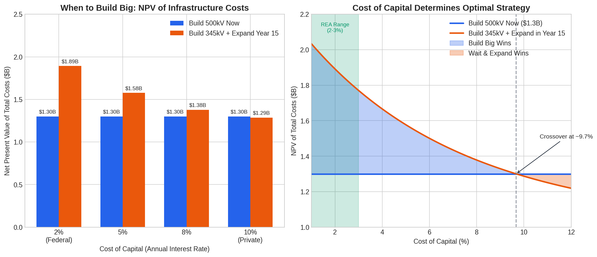
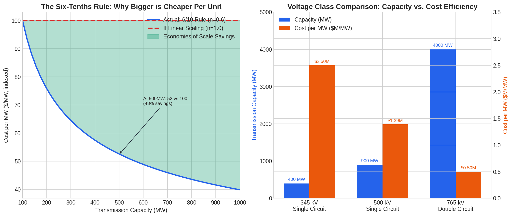
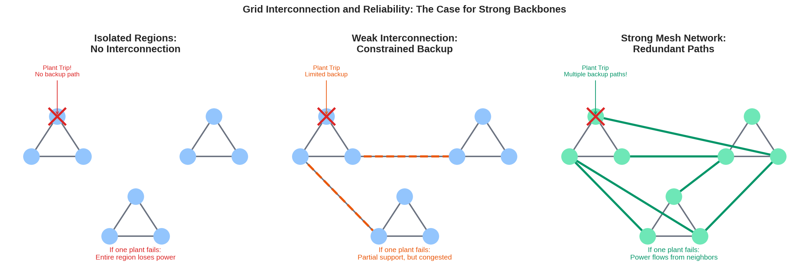
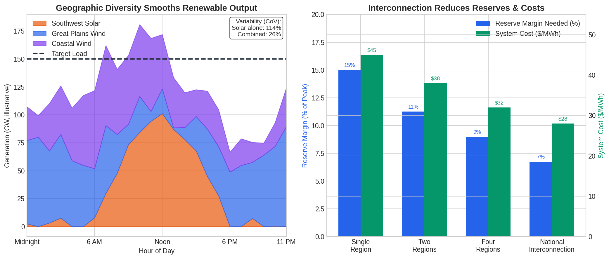
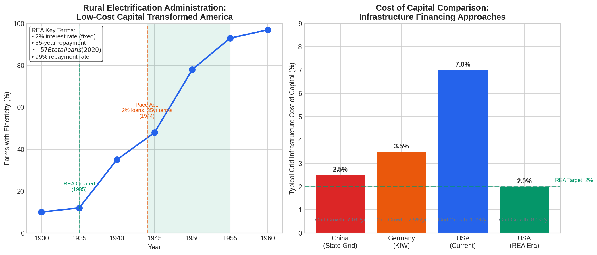

# Grid Economics: Quantitative Analysis

## Key Findings Summary

The economic case for building grid infrastructure with headroom rests on three quantifiable dynamics:

1. **Cost of Capital Effect**: At 2% federal financing, building big upfront beats building small and expanding later. At 8%+ private financing, the opposite is true.

2. **Six-Tenths Rule**: Doubling transmission capacity costs roughly 50% more, not 100% more. Bigger infrastructure is cheaper per unit.

3. **Reliability Benefits**: Interconnected grids reduce reserve requirements by 40-50% through resource pooling and geographic diversity.

---

## Figure 1: The Cost of Capital Tradeoff

### The Calculation

*Illustrative example demonstrating how discount rates affect infrastructure investment decisions.*

Consider a utility choosing between:
- **Option A**: Build a 500kV line now for $1.3 billion
- **Option B**: Build a 345kV line for $1.0 billion, then expand in Year 15 for $1.2 billion

The net present value of Option B depends entirely on the discount rate:

| Discount Rate | NPV of Option A | NPV of Option B | Winner |
|---------------|-----------------|-----------------|--------|
| 2% (Federal)  | $1.30B          | $1.89B          | Build Big |
| 5%            | $1.30B          | $1.58B          | Build Big |
| 8%            | $1.30B          | $1.39B          | Close call |
| 10%           | $1.30B          | $1.29B          | Wait & Expand |

**Key insight**: The crossover point is around 8%. Below that rate, building big now is cheaper in NPV terms. Above that rate, waiting makes sense because the discounted future cost is low enough.

The Rural Electrification Administration operated at 2-3%. At those rates, building for 50 years was obviously correct.

---

## Figure 2: Economies of Scale (Infrastructure Scaling Laws)

### The Math

The six-tenths rule states that capital costs scale with capacity according to:

$$C_2 = C_1 \times \left(\frac{S_2}{S_1}\right)^{0.6}$$

Where:
- $C$ = cost
- $S$ = capacity
- The exponent 0.6 (not 1.0) creates economies of scale

**Example**: If a 500 MW line costs $100M, what does a 1000 MW line cost?

$$C_{1000} = 100 \times \left(\frac{1000}{500}\right)^{0.6} = 100 \times 2^{0.6} = 100 \times 1.52 = \$152M$$

So doubling capacity costs only 52% more, not 100% more.

### Voltage Class Comparison

| Line Type | Capacity (MW) | Est. Cost ($B) | Cost per MW ($M/MW) |
|-----------|---------------|----------------|---------------------|
| 345 kV Single Circuit | 400 | 1.0 | 2.50 |
| 500 kV Single Circuit | 900 | 1.25 | 1.39 |
| 765 kV Double Circuit | 4000 | 2.0 | 0.50 |

**Key insight**: The 765kV double circuit costs 2x as much as the 345kV line but delivers 10x the capacity. Cost per MW is 80% lower.

---

## Figure 3: Grid Interconnection and Reliability

### Why Interconnection Matters

A grid functions as a mesh network. When one generator trips:
- **Isolated regions**: Local load shedding or blackout
- **Weak interconnection**: Power can flow from neighbors, but constrained
- **Strong backbone**: Multiple paths allow power to flow around the failure

The Great Northeast Blackout of 1965 occurred because weak interconnections couldn't handle the cascading failures. The response was massive investment in transmission to create redundant paths.

### Quantifying the Benefit

For renewables, geographic diversity provides additional value:
- Solar in Arizona peaks at noon
- Wind in the Plains often peaks at night
- Wind in California coastal areas peaks in afternoon

Combining these resources through transmission reduces overall variability by 40-60%.

---

## Figure 4: Interregional Benefits

### Reserve Sharing Math

Operating reserves scale with the square root of system size, not linearly. If each region individually needs 15% reserves, combining them reduces the total:

| Configuration | Total Reserve Need | Cost Savings |
|---------------|-------------------|--------------|
| 1 Region (isolated) | 15.0% | Baseline |
| 2 Regions (connected) | 10.6% | ~29% reduction |
| 4 Regions (connected) | 7.5% | ~50% reduction |
| National Interconnection | ~6-7% | ~55% reduction |

This is why interconnected grids can operate with lower reserve margins while maintaining reliability.

### System Cost Impact

Studies of European and US grids show that strong interconnection reduces wholesale electricity costs significantly—MISO estimates $3-4 billion in annual savings, while a University of Chicago study found roughly 5% production cost savings—through:
- Access to lower-cost generation
- Reduced reserve requirements
- Better renewable integration
- Load diversity benefits

---

## Figure 5: REA Success and International Comparison

### The REA Model

The Rural Electrification Administration (1935-1994) deployed roughly $57 billion in nominal cumulative loans (estimated $100-200 billion in today's dollars) to electrify rural America.

**Key terms:**
- Interest rate: 2% (fixed after 1944 Pace Act)
- Repayment period: 35 years
- Repayment rate: >99%

**Results:**
- 1935: ~10% of farms electrified
- 1955: 93% of farms electrified
- Total timeline: ~20 years to near-universal coverage

### International Context

| Country/Program | Cost of Capital | Grid Growth Rate | Model |
|-----------------|-----------------|------------------|-------|
| China (State Grid) | ~2-3% (est.) | 7%/year | State-directed |
| Germany (KfW) | ~3.5% | 2.5%/year | Public bank + private |
| USA Current | ~7% | 1%/year | Private with regulation |
| USA REA Era | 2% | 8%/year | Federal lending |

**Key insight**: Low cost of capital correlates strongly with rapid grid expansion. The US achieved grid growth rates comparable to China's when federal capital was available at 2%.

### China's Current Investment

China's State Grid Corp is investing $574 billion (4 trillion yuan) over 2026-2030, a 40% increase from the prior five-year period. In 2025 alone:
- $88 billion in transmission and distribution
- 42 UHV lines operational (the vast majority of all UHV lines worldwide)

This investment is state-directed and state-financed, enabling long-term planning without private return requirements.

---

## Figure 6: The Cost of Conservative Planning

### The Distribution Transformer Example

*This is an illustrative model demonstrating the cost dynamics of incremental vs. proactive investment.*

Consider a distribution utility preparing for EV adoption. If they use 5-year planning horizons:

| Year | Action | Cost | Cumulative |
|------|--------|------|------------|
| 0 | Initial build | $20M | $20M |
| 5 | First upgrade | $25M | $45M |
| 10 | Second upgrade | $30M | $75M |
| 15 | Third upgrade | $35M | $110M |
| 20 | Fourth upgrade | $40M | $150M |

**Total: $150M over 20 years**

If they instead built for 50% EV penetration upfront:

| Year | Action | Cost | Cumulative |
|------|--------|------|------------|
| 0 | Build for growth | $35M | $35M |

**Total: $35M**

**Savings: $115M (77%)**

This is why the "prudent" approach of building conservatively can cost 4-5x as much in aggregate.

---

## Figure 7: The Preparation Delta

### Tower Preparation Options

*Illustrative cost indices demonstrating the economics of preparation. Actual costs vary by project.*

When building a transmission tower, you can prepare for future expansion at modest upfront cost:

| Preparation Level | Initial Cost | Max Capacity | Expansion Cost | Total Lifecycle |
|------------------|--------------|--------------|----------------|-----------------|
| Base 345kV | 100 | 1.0x | 200 (new line) | 300 |
| Ready for 500kV | 110 | 2.0x | 30 | 140 |
| Ready for reconductoring | 108 | 2.0x | 25 | 133 |
| Ready for double circuit | 115 | 2.0x | 40 | 155 |
| Full preparation | 125 | 8.0x | 60 | 185 |

**Key insight**: Full preparation costs 25% more upfront but enables 8x capacity growth at total lifecycle cost of only 185 (vs. 300 for unprepared expansion). Cost per MW of capacity is 80% lower.

### What "Preparation" Means

- **Structural rating**: Tower designed for higher voltage conductors
- **Second circuit space**: Tower has room for additional wires below
- **Substation bays**: Extra space for future breakers/transformers
- **Breaker sizing**: Current-handling capacity exceeds initial needs
- **Foundation strength**: Supports future heavier equipment

Federal funding for the "preparation delta" (the extra 10-25% upfront) would have massive leverage. Every dollar spent on preparation avoids $3-5 in future expansion costs.

---

## Policy Implications

### 1. Federal Capital at 2% Changes Everything

At current private financing rates (7-10%), waiting and building incrementally can be rational. At 2% federal rates:
- Building for 50 years beats building for 10 years
- Carrying costs of unused capacity become negligible
- The "right" decision is always to build bigger

The REA proved this worked. From 10% to 93% rural electrification in 20 years, with a 99%+ loan repayment rate.

### 2. Fund the Preparation Delta

The federal government could pay the incremental cost of preparing infrastructure for future expansion:
- Tower designs rated for higher voltage
- Substation bays for future equipment
- Breaker sizing for reconductoring

Cost: 10-25% of project value
Return: Enables 4-8x capacity growth at 80% lower cost per MW

### 3. Grants for Right-Sizing

When the "right" answer is 500kV but 345kV is easier to justify, a 20% federal grant tips the decision. The federal government takes the long side of the bet on American growth.

---

---

## The ROE Problem: Transmission Owners Are Overpaid for Risk They Don't Bear

### Current Returns Are Too High

FERC currently allows transmission owners to earn returns on equity (ROE) around 9.9-10.5%, with various "adders" that can push returns even higher:

| Component | Typical Value |
|-----------|---------------|
| Base ROE | 9.9-10.0% |
| RTO Participation Adder | +0.5% |
| Advanced Technology Adder | +0.5% |
| Transmission Security Adder | +0.5% |
| **Potential Total** | **11.0-11.5%** |

These returns are supposed to compensate for risk. But what risk, exactly?

### The Risk Argument Doesn't Hold

Transmission is among the lowest-risk investments in the energy sector:

1. **Guaranteed cost recovery**: Transmission owners recover costs through regulated rates (Annual Transmission Revenue Requirement, or ATRR). They get paid for keeping the wires up regardless of market conditions.

2. **No commodity risk**: Unlike generators, transmission owners don't face fuel price or electricity price risk.

3. **No demand risk**: Load pays for transmission whether or not they use it. If load grows, revenues increase. If load shrinks, rates adjust to maintain revenue.

4. **Regulatory compact**: The "regulatory compact" essentially guarantees a return in exchange for an obligation to serve.

The MISO transmission owners were collecting 12.38% ROE for nearly two decades before FERC ruled it "unjust and unreasonable" in 2019. Even the reduced 9.98% ROE is generous for what is essentially a cost-plus regulated monopoly.

### If Federal Capital Backs the Grid, Returns Should Fall

If the federal government provides:
- Low-cost capital (2% loans)
- Permitting certainty (federal siting authority)
- Demand risk absorption (building for growth)

Then the risk profile of transmission ownership changes dramatically. The private return should fall accordingly.

Consider the logic: If the government provides 2% capital and absorbs the "did we build too much?" risk, what's left for the private transmission owner to do? Operate and maintain the asset. That's not nothing, but it's not a 10% return business either.

A reasonable framework might look like:

| Risk Bearer | What They Get |
|-------------|---------------|
| Federal government | Takes long-term demand risk, provides capital at 2% |
| Transmission owner | Operates asset, earns 5-6% return on equity invested |
| Ratepayers | Pay lower total cost due to reduced capital costs and risk premiums |

This is how the REA worked. The federal government provided 2% loans and the cooperatives operated the assets. The result was rapid buildout at low cost.

---

## Who Should Hold Infrastructure Risk? The Government.

### The Basic Logic

When building 50-year infrastructure with uncertain demand, someone has to make a bet. The question is: who is best positioned to hold that risk?

**Private investors** want returns in 5-10 years. They discount future benefits heavily. They build conservatively because they don't capture the upside from economic growth they enable.

**The federal government** has a 50-year (or longer) time horizon. It borrows at the lowest rates available. And crucially: it captures the upside from growth through tax revenue.

If transmission enables a factory to locate in Ohio instead of moving overseas, the federal government benefits through:
- Corporate income taxes from the factory
- Personal income taxes from workers
- Payroll taxes
- Reduced unemployment insurance claims
- Economic activity multipliers

The private transmission owner captures none of this. They just get their regulated return on the wires.

### The Mazzucato Framework: Socializing Risk, Privatizing Rewards

Economist Mariana Mazzucato's "Entrepreneurial State" thesis is directly relevant here. Her core argument: governments routinely take the biggest risks on transformative investments, but the rewards flow to private actors.

Every technology in the iPhone came from government-funded research: the internet (DARPA), GPS (DoD), touch screens (CIA/NSF), Siri (DARPA), lithium-ion batteries (DOE). Apple integrated them beautifully and captured the profits.

The same dynamic plays out in infrastructure. The federal government provides:
- Land grants for railroads
- Low-cost capital for rural electrification
- Loan guarantees for nuclear plants
- Tax credits for renewables

Private companies capture the returns, and often avoid taxes through sophisticated structures.

Mazzucato's prescription: if the government takes the risk, it should share in the rewards. For grid infrastructure, this could mean:
- Federal equity stakes in transmission projects
- Royalties from transmission revenue
- Or simply: building public transmission and capturing returns directly

### Why Government Is the Right Risk-Bearer for Grid Infrastructure

Grid infrastructure has specific characteristics that make it suitable for public risk-bearing:

**1. Network externalities**: The value of the grid increases non-linearly with connections. Private actors can't capture these network effects.

**2. Coordination problems**: Building transmission requires coordinating across multiple states, utilities, and jurisdictions. Government can solve coordination problems that markets cannot.

**3. Long time horizons**: 50-year assets require patient capital. Government is the most patient capital available.

**4. Growth capture**: The entity that benefits most from economic growth is the entity that should bet on growth. That's the federal government.

**5. Countercyclical capacity**: Government can invest when private capital retreats, smoothing economic cycles.

### The Fiscal Externality

Here's the key insight that's often missed: when the grid enables economic growth, the federal government captures 20-35% of that growth through taxes.

If a $10 billion transmission investment enables $50 billion in new economic activity:
- At a 25% effective federal tax rate, that's $12.5 billion in federal revenue
- The investment has already paid for itself in tax revenue alone
- Everything else (jobs, local taxes, consumer surplus) is gravy

This is why the federal government should be willing to take grid infrastructure risk that private actors won't. The expected value is positive for the government even when it's negative for private investors.

### Historical Precedent: The REA Model

The Rural Electrification Administration wasn't charity. It was good business for the federal government.

Before REA:
- Rural areas had no electricity
- Agricultural productivity was low
- Rural poverty was endemic
- Tax base was minimal

After REA:
- Rural productivity soared
- Agricultural output increased dramatically
- Rural incomes rose
- Tax revenues from rural America increased

The 2% loans paid for themselves many times over through the economic activity they enabled. The 99%+ repayment rate was almost beside the point.

### The "Bet" Revisited

So here's the question: Do we want growth or not?

If we're betting on American growth:
- Build the grid big
- Use federal capital at 2%
- Let the government hold the demand risk
- Capture the upside through tax revenue

If we're not betting on growth:
- Build conservatively
- Use private capital at 8-10%
- Pass the cost to ratepayers
- Watch manufacturing locate elsewhere

The REA made the bet. China is making the bet now ($574 billion through 2030). The question is whether we're willing to make it again.

---

## Conclusion

The math is clear:
- Low cost of capital favors building big
- Economies of scale make bigger infrastructure cheaper per unit
- Interconnection reduces reserves and improves reliability
- Preparation for growth costs little upfront but saves enormously later
- Current transmission owner returns don't match actual risk
- The federal government is the right entity to hold long-term infrastructure risk

The REA achieved 7-8% annual grid growth at 2% interest rates. China is achieving similar growth with state-directed capital. The US currently achieves ~1% growth with private financing at 7-10%.

The federal government captures the upside from economic growth through tax revenue. Private transmission owners don't. This is why the federal government should be willing to take infrastructure bets that private actors rationally avoid.

We've done this before. The REA proved it worked. The question isn't whether these dynamics exist. The question is whether we choose to take advantage of them again.

The alternative is watching from the sidelines as manufacturing locates elsewhere, data centers build their own generation behind the meter, and the grid becomes a constraint on American growth rather than an enabler of it.

Build the grid. Use federal capital. Take the long side of the bet on America.
